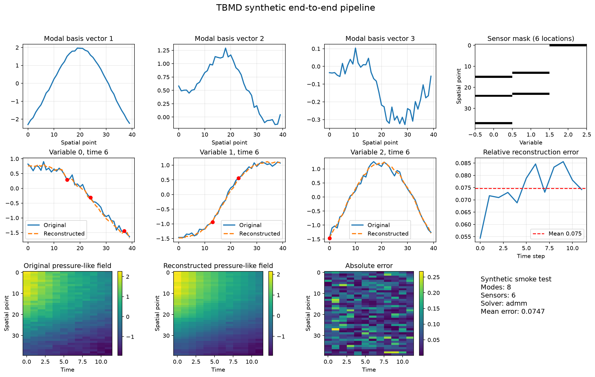

# Tensor-Based Modal Decomposition Method

[](https://github.com/denis-samatov/tensor-based-modal-decomposition-method/actions/workflows/ci.yml)
[](https://opensource.org/licenses/MIT)

[](https://arxiv.org/abs/2607.09687)

A Python research library for reduced-order modeling of spatiotemporal tensor data.

## Reproduce the public example

The repository includes a synthetic end-to-end example and software tests. **The exact Brugge manuscript tables and figures cannot currently be regenerated from this repository alone**: processed data, simulator outputs, orchestration, and complete run metadata are not distributed here. See the [reproducibility matrix](REPRODUCIBILITY.md#public-reproducibility-scope).

After installation, run:

```bash
python examples/basic/04_complete_pipeline.py --spatial-points 40 --time-steps 12 --n-modes 8 --n-sensors 6 --solver admm --visualize
```

This generates analytic fields with seed 42, selects six spatial-variable sensor locations, reconstructs the fields, and writes `tbmd_complete_pipeline_8modes_6sensors_admm.png`. Expected completion: `TBMD synthetic complete pipeline completed successfully.` This is a software demonstration on generated data, not a held-out Brugge evaluation.



[Captured run and environment](docs/examples/synthetic-run.md). The modal basis and reconstruction in this smoke test use the same generated sequence; the displayed error is not a held-out generalization metric.

## What this project does
Tensor-Based Modal Decomposition Method (TBMD) compresses high-dimensional spatiotemporal data (such as computational fluid dynamics or reservoir-modeling datasets) into a compact modal representation. It uses these representations to select sensor placements with a QR-based method and reconstruct full fields from sparse measurements.

## Who this is for
- **ML/AI Engineers & Data Scientists**: For building and orchestrating modal decomposition pipelines.
- **Scientific Computing Researchers**: For experimenting with tensor decompositions (Tucker/HOSVD) and geometry-aware representations.
- **Developers**: For extending and integrating the core mathematical components into larger simulation workflows.

## Core capabilities
- **Tucker/HOSVD decomposition** for spatiotemporal tensor data.
- **Modal tensor processing** utilities for building reduced bases.
- **Tensor QR-based sensor placement** to find the most informative measurement locations.
- **Compressive sensing reconstruction** with ADMM-based solvers.
- **Geometry-aware variants** for decomposition, reconstruction, and sensor placement on irregular grids.

## Architecture at a glance
The library is composed of modular components built primarily on PyTorch.
The synthetic example uses a `(space, variable, time)` tensor. Tucker decomposition produces factors and a core; modal processing builds a basis; Tensor Tube QR selects spatial-variable locations; a coefficient solver reconstructs the field from those measurements. Manuscript inputs use a separate four-dimensional reservoir representation.

For more details, see the [Architecture Overview](docs/architecture/overview.md).

## Quick start
1. Clone the repository:
```bash
git clone https://github.com/denis-samatov/tensor-based-modal-decomposition-method.git
cd tensor-based-modal-decomposition-method
```
2. Install as an editable package with development dependencies:
```bash
python -m venv .venv
source .venv/bin/activate
python -m pip install --upgrade pip
python -m pip install -e ".[dev]"
```
3. Run a basic decomposition script:
```bash
python examples/basic/01_tucker_decomposition.py
```

## Configuration
Configuration is managed strictly through Python dataclasses located in `TBMD.config`, rather than environment variables or external files. See the [Configuration Guide](docs/setup/configuration.md) for details.

## Testing
To verify the installation and run unit tests:
```bash
pytest
```
To run targeted repository hygiene and architecture checks:
```bash
pytest tests/audit -q
```
For more information, see the [Testing Guide](docs/development/testing.md).

## Benchmarks

Runtime and peak memory for each pipeline stage, measured by
[`measure_brugge_runtime.py`](measure_brugge_runtime.py) on a local development machine
(Apple Silicon, arm64, macOS, Python 3.12.12), averaged over 3 runs after a cold-start
warm-up run was discarded. Input is the local, untracked Brugge experiment dataset — see
[Known limitations](#known-limitations) and [`REPRODUCIBILITY.md`](REPRODUCIBILITY.md):
this profiles pipeline performance, it is not a reproduction of the manuscript's Brugge
numerical results.

| Stage | Wall time | Peak memory (RSS delta) | Absolute peak RSS |
|---|---|---|---|
| TBMD (Tucker/HOSVD decomposition) | ~0.20 s | ~32 MB | ~392 MB |
| QR sensor placement (pivoted QR) | ~0.001 s | ~0.2 MB | ~392 MB |
| CS recovery (ADMM) | ~0.003 s | ~1.1 MB | ~393 MB |

Input tensor shape for this run: `(139, 48, 2, 133)` (space × space × field × time),
decomposed with `epsilon=1e-2`. The QR/CS stages here run on a `(13344, 8)` dictionary,
so their timings are near the process's scheduling-resolution floor — read them as an
order-of-magnitude signal for this problem size, not a precise micro-benchmark. Peak
memory is dominated by loading the ~140 MB HDF5 source file and constructing the
`(space, space, field, time)` tensor in memory, not by the decomposition itself.

### Map of documentation

- **Product & Concepts**: [`docs/product/overview.md`](docs/product/overview.md)
- **Architecture**: [`docs/architecture/overview.md`](docs/architecture/overview.md)
- **Mathematical & Research Pipeline**: [`docs/research-system/reconstruction-pipeline.md`](docs/research-system/reconstruction-pipeline.md)
- **Interfaces & Python Usage**: [`docs/interfaces/python-api.md`](docs/interfaces/python-api.md)
- **Installation & Setup**: [`docs/setup/local-development.md`](docs/setup/local-development.md)
- **Running Experiments**: [`docs/operations/runbook.md`](docs/operations/runbook.md)
- **Contributing & Code Style**: [`docs/development/contribution-guide.md`](docs/development/contribution-guide.md)
- **Operations & Runbooks**: [`docs/operations/runbook.md`](docs/operations/runbook.md)


## Known limitations
This project is an experimental research codebase. Claims regarding accuracy, performance, or "production-readiness" require explicit verification. Local datasets and generated artifacts must not be tracked in version control. See [Limitations](docs/product/limitations.md).

## Contributing
We welcome improvements! Please review the [Contribution Guidelines](CONTRIBUTING.md) before opening a Pull Request.

## License / ownership
MIT License. See `LICENSE`.

## Citation

This repository implements the method described in:

> D. Samatov, B. Merzlikin, and G. Shishaev, "Tensor-Based Modal Decomposition and
> Sparse Sensor Placement for the Brugge Field Simulation Model," arXiv:2607.09687, 2026.
> https://arxiv.org/abs/2607.09687

```bibtex
@article{samatov2026tbmd,
  title   = {Tensor-Based Modal Decomposition and Sparse Sensor Placement for the Brugge Field Simulation Model},
  author  = {Samatov, D. and Merzlikin, B. and Shishaev, G.},
  journal = {arXiv preprint arXiv:2607.09687},
  year    = {2026},
  url     = {https://arxiv.org/abs/2607.09687}
}
```

See [`CITATION.cff`](CITATION.cff) for citing this software directly.

## Reproducing the Computers & Geosciences manuscript

The [reproducibility guide](REPRODUCIBILITY.md) distinguishes public software
checks from the unavailable local artifacts used for the manuscript's Brugge
numerical results.

**Quick Setup:**
```bash
python -m venv .venv
source .venv/bin/activate
pip install -e ".[dev]"
```

**Synthetic end-to-end smoke test:**
```bash
python examples/basic/04_complete_pipeline.py \
  --spatial-points 40 \
  --time-steps 12 \
  --n-modes 8 \
  --n-sensors 6 \
  --solver admm
```

This command generates its data in memory and exercises Tucker decomposition,
modal processing, Tensor Tube QR sensor placement, and sparse reconstruction.
It does not reproduce the manuscript's Brugge metrics or figures. The exact
processed Brugge tensors, simulator outputs, experiment orchestration, and run
metadata are not distributed in this repository; no GitHub or Zenodo dataset
download is claimed.
